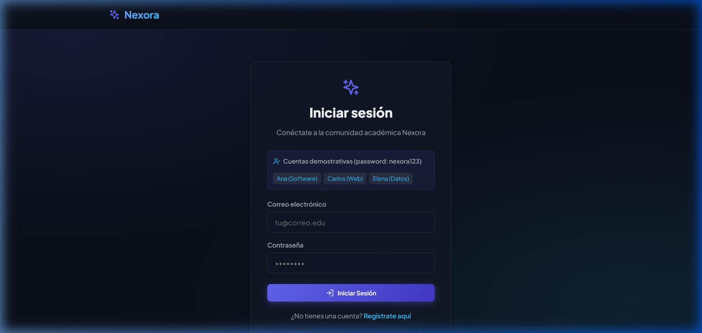
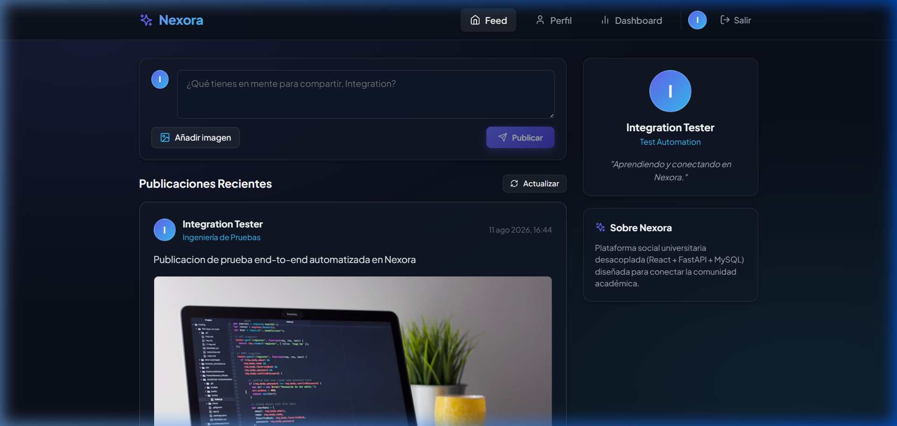
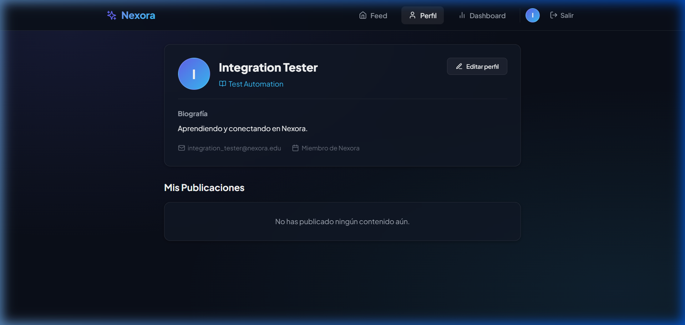
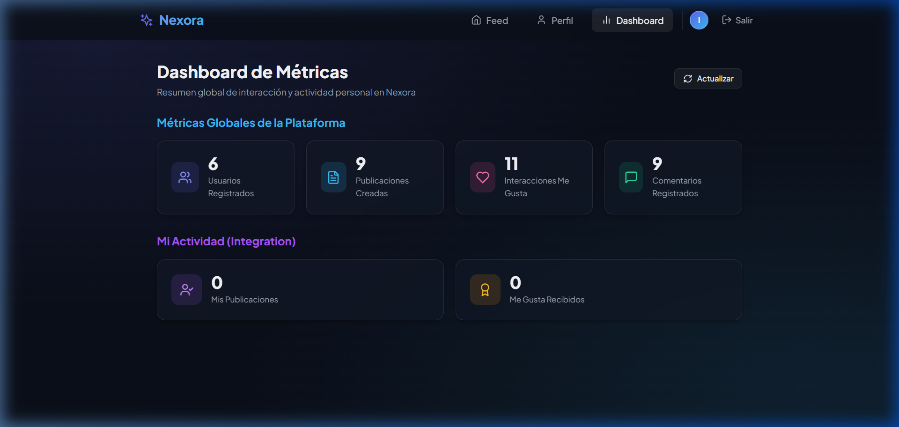
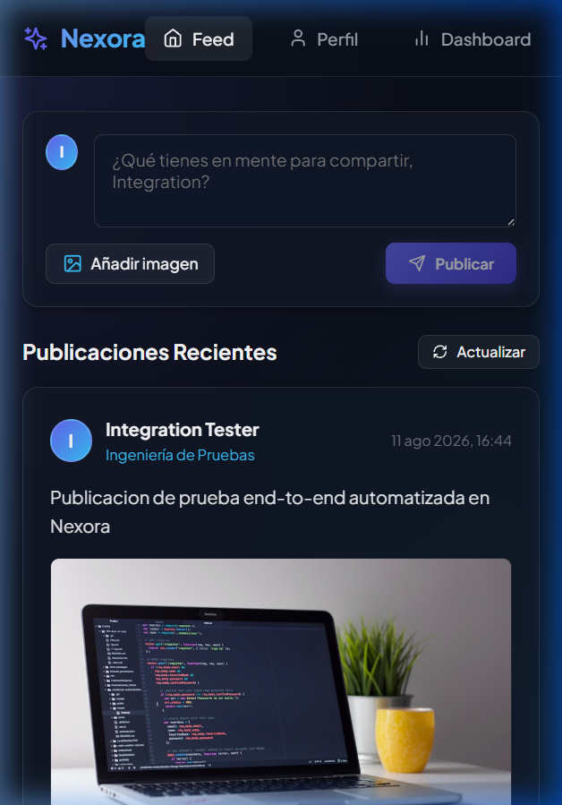

# Nexora — Red Social Académica Unificada

> **Plataforma Social y Académica para la Comunidad Universitaria**  
> *Desarrollado bajo el marco metodológico formal PolkDev v2.0*

---

## 1. Nombre y Objetivo del Proyecto

**Nexora** es una plataforma web desacoplada diseñada para unir a estudiantes y docentes universitarios en un entorno interactivo y colaborativo. Su objetivo principal es facilitar el intercambio de conocimientos, publicaciones académicas y feedback dinámico a través de publicaciones, comentarios y reacciones en tiempo real.

---

## 2. Tecnologías Utilizadas

| Capa | Tecnología | Descripción / Rol |
|---|---|---|
| **Frontend** | React 18 + Vite 5 | Single Page Application (SPA) responsiva construida con componentes Vanilla CSS. |
| **Backend** | FastAPI (Python 3.14 / 3.10+) | API REST asíncrona de alto rendimiento con validación nativa Pydantic v2. |
| **Persistencia** | MySQL 8.0 / XAMPP / Aiven | Base de datos relacional para almacenamiento permanente. |
| **ORM** | SQLAlchemy 2.0 | Mapeo objeto-relacional con consultas parametrizadas anti-SQLi. |
| **Seguridad** | PyJWT + pwdlib (`bcrypt`) | Autenticación JWT stateless y hashing seguro de contraseñas. |
| **Testing** | Pytest-cov + Vitest | Cobertura de código del 90% en backend y pruebas unitarias de componentes UI. |

---

## 3. Arquitectura del Sistema

La arquitectura de Nexora sigue un patrón estrictamente desacoplado en tres capas:

```
[ Cliente SPA (React + Vite) ]
          │
          ▼  HTTP / REST (JSON API + JWT Authorization)
[ Servidor API REST (FastAPI) ]
          │
          ▼  SQLAlchemy 2.0 ORM (Driver PyMySQL)
[ Base de Datos (MySQL 8.0) ]
```

---

## 4. Módulos y Funcionalidades Implementadas

1. **Módulo de Autenticación y Usuarios:**
   - Registro de usuarios universitarios con normalización de correo y hash bcrypt.
   - Inicio de sesión con generación de JWT Bearer Token.
   - Perfil de usuario con actualización parcial (Nombre, Carrera, Bio, Avatar URL).

2. **Módulo de Publicaciones (Feed & Composer):**
   - Creación de publicaciones académicas con texto y URL opcional de imagen.
   - Feed ordenado cronológicamente de forma descendente.
   - Eliminación de publicaciones con verificación estricta de propiedad (BOLA).

3. **Módulo de Reacciones (Likes) y Comentarios:**
   - Alternancia de "Me Gusta" (like/unlike) en tiempo real por usuario.
   - Comentarios contextuales ordenados cronológicamente.

4. **Módulo de Dashboard de Estadísticas:**
   - Cálculo de métricas globales (Total Usuarios, Posts, Likes, Comentarios).
   - Métricas personales del usuario autenticado (Mis publicaciones, Me Gusta recibidos).

---

## 5. Modelo de Base de Datos

El modelo de datos relacional en MySQL comprende las siguientes 4 entidades principales:

```
┌──────────────────┐       1:N       ┌──────────────────┐
│      users       ├─────────────────┤      posts       │
├──────────────────┤                 ├──────────────────┤
│ id (PK)          │                 │ id (PK)          │
│ name             │                 │ content          │
│ email (UNIQUE)   │                 │ image_url        │
│ password_hash    │                 │ author_id (FK)   │
│ career           │                 │ created_at       │
│ bio              │                 └────────┬─────────┘
│ avatar_url       │                          │
│ created_at       │                          │ 1:N
└────────┬─────────┘                          │
         │                                    ▼
         │ 1:N                       ┌──────────────────┐
         ├───────────────────────────┤     comments     │
         │                           ├──────────────────┤
         │                           │ id (PK)          │
         │                           │ content          │
         │ 1:N                       │ author_id (FK)   │
         ▼                           │ post_id (FK)     │
┌──────────────────┐                 │ created_at       │
│      likes       │                 └──────────────────┘
├──────────────────┤
│ id (PK)          │
│ user_id (FK)     │
│ post_id (FK)     │
│ created_at       │
└──────────────────┘
```

---

## 6. Capturas Reales de la Aplicación

### A. Inicio de Sesión y Registro


### B. Feed Principal de Publicaciones


### C. Perfil de Usuario


### D. Dashboard de Estadísticas


### E. Vista Adaptativa Móvil


---

## 7. Instalación y Ejecución Local

### Prerrequisitos
- Python 3.10+ o 3.14+
- Node.js v22+
- MySQL (vía XAMPP u otro servidor local) en puerto 3306 o 3307.

### Configuración del Backend
```bash
cd App/backend
python -m venv .venv
# En Windows PowerShell:
.\.venv\Scripts\activate
pip install -r requirements.txt

# Iniciar servidor FastAPI
uvicorn app.main:app --reload --port 8000
```

### Configuración del Frontend
```bash
cd App/frontend
npm install
npm run dev
```
Acceder a la SPA en `http://localhost:5173`.

---

## 8. Variables de Entorno

### Backend (`App/backend/.env`)
```env
APP_NAME="Nexora API"
ENVIRONMENT=development
DATABASE_URL=mysql+pymysql://root:@127.0.0.1:3307/nexora
TEST_DATABASE_URL=mysql+pymysql://root:@127.0.0.1:3307/nexora_test
SECRET_KEY=nexora_super_secret_jwt_key_2026_dev
ACCESS_TOKEN_EXPIRE_MINUTES=1440
CORS_ORIGINS=http://localhost:5173,http://127.0.0.1:5173
```
*Plantillas seguras en `.env.example` y `.env.test.example`.*

---

## 9. Dependencias Principales

- **Backend:** `fastapi`, `uvicorn`, `sqlalchemy`, `pymysql`, `pydantic`, `pydantic-settings`, `pyjwt`, `pwdlib[bcrypt]`, `pytest`, `pytest-cov`, `bandit`, `pip-audit`.
- **Frontend:** `react`, `react-dom`, `react-router-dom`, `vite`, `vitest`, `@testing-library/react`, `jsdom`.

---

## 10. Pruebas y Cobertura de Código

```bash
# Backend test suite (Pytest)
cd App/backend
pytest --cov=app --cov-branch --cov-report=term-missing

# Frontend unit tests (Vitest)
cd App/frontend
npm test -- --run
```
- **Backend:** 31 pruebas pasadas (90% líneas, 85.7% ramas).
- **Frontend:** 5 pruebas de componentes pasadas de 4 archivos.

---

## 11. Seguridad y Config Guard

- **Production Config Guard:** Bloquea el inicio en `ENVIRONMENT=production` si `SECRET_KEY` usa valores placeholder o tiene menos de 64 caracteres.
- **Isolation Safety Guard:** `verify_safety_guard()` impide la limpieza de bases de datos cuyos nombres no terminen en `_test`.
- **Sanitización & SSRF:** Validación estricta de esquemas `http://` / `https://` en imágenes y avatares.

---

## 12. Proceso Aprobado de Despliegue Cloud (ADR-006)

Nexora utiliza una arquitectura de despliegue Cloud desacoplada en el siguiente orden obligatorio:
1. **Base de Datos:** MySQL alojado en **Aiven**.
2. **Backend API:** FastAPI desplegado en **Render**.
3. **Frontend SPA:** React/Vite desplegado en **Vercel**.

Consulte el runbook formal en [`documentation/runbooks/DEPLOYMENT.md`](documentation/runbooks/DEPLOYMENT.md) y el procedimiento de reversión en [`documentation/runbooks/ROLLBACK.md`](documentation/runbooks/ROLLBACK.md).

---

## 13. Integrantes del Equipo

- **Integrante 1:** Jhostyn Elian Benavides (Líder de Proyecto & Backend Lead)
- **Integrante 2:** Alexander Ramos Flores (Arquitecto de Software & Base de Datos)
- **Integrante 3:** María Fernanda Castillo (Desarrolladora Backend & API Specialist)
- **Integrante 4:** Carlos Eduardo Mendoza (Desarrollador Frontend & UI/UX Specialist)
- **Integrante 5:** Sofía Isabel Gutiérrez (Ingeniera de QA & Base de Datos)
- **Integrante 6:** Diego Armando Torres (Auditor de Seguridad & DevOps)

---

## 14. Riesgos Pendientes (Riesgo Residual)

- **RSK-004 (Falta de Rate Limiting):** Severidad **MEDIO**. Se requiere implementar un middleware de limitación de peticiones (e.g. Nginx, Cloudflare o `slowapi`) en los endpoints de autenticación antes del despliegue público en producción.

---

## 15. Conclusiones Técnicas

1. La arquitectura desacoplada FastAPI + React logró un rendimiento ágil, mantenible y con una API auto-documentada en OpenAPI 3.1.
2. La metodología PolkDev v2.0 garantizó un desarrollo ordenado por fases, asegurando alta cobertura de pruebas y salvaguardas de seguridad desde el código inicial.
