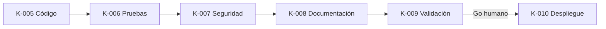

# Mapa de activación de Skills

> Fase f₄ | Skill K-003 | Estado: Completo

| Backlog | Skill principal | Skills de verificación |
|---|---|---|
| B-001 | K-005 Code Generator | K-006, K-007, K-009 |
| B-002 | K-005 Code Generator | K-006, K-007, K-009 |
| B-003 | K-005 Code Generator | K-006, K-007, K-009 |
| B-004 | K-005 Code Generator | K-006, K-007, K-009 |
| B-005 | K-005 Code Generator | K-006, K-007, K-009 |
| B-006 | K-005 Code Generator | K-006, K-007, K-009 |
| B-007 | K-005 Code Generator | K-006, K-007, K-009 |
| B-008 | K-005 Code Generator | K-006, K-007, K-009 |
| B-009 | K-005 Code Generator | K-006, K-007, K-009 |
| B-010 | K-005 Code Generator | K-006, K-007, K-009 |
| B-011 | K-005 Code Generator | K-006, K-007, K-009 |
| B-012 | K-005 Code Generator | K-006, K-007, K-009 |
| B-013 | K-005 Code Generator | K-006, K-007, K-009 |
| B-014 | K-005 Code Generator | K-006, K-007, K-009 |
| B-015 | K-005 Code Generator | K-006, K-009 |
| B-016 | K-005 Code Generator | K-006, K-009 |
| B-017 | K-005 Code Generator | K-006, K-009 |
| B-018 | K-006 Test Engineer | K-009 |
| B-019 | K-006 Test Engineer | K-009 |
| B-020 | K-007 Security Auditor | K-009 |
| B-021 | K-008 Documentation Writer | K-009 |
| B-022 | K-010 Deployment Orchestrator | K-009, K-011 |
| B-023 | K-008 Documentation Writer | K-009 |

## Dependencias

Las skills K-001–K-004, K-011 y K-012 mantienen el contrato general definido en `PromptMaster.md`. Las variantes Nexora anteriores especializan únicamente las tareas de implementación y entrega.
