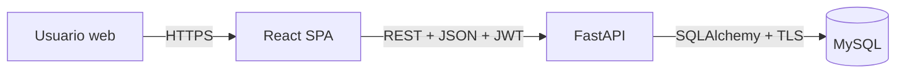
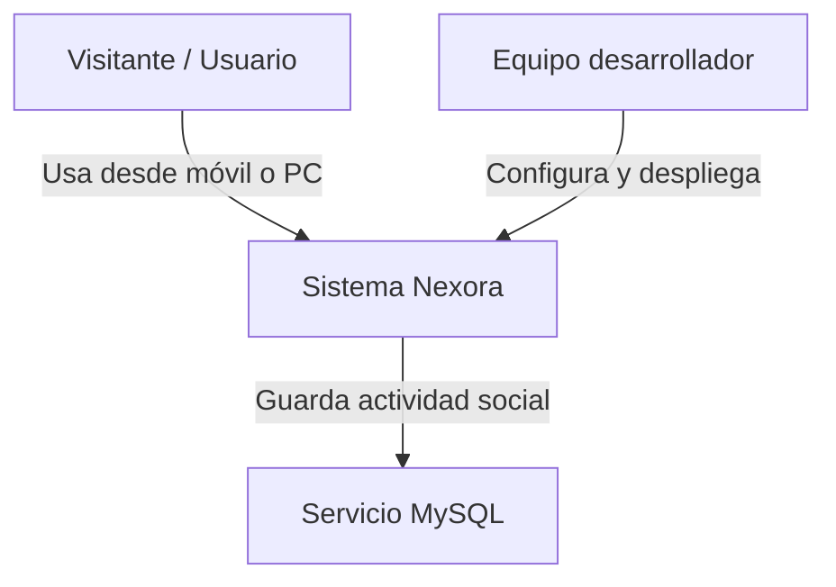
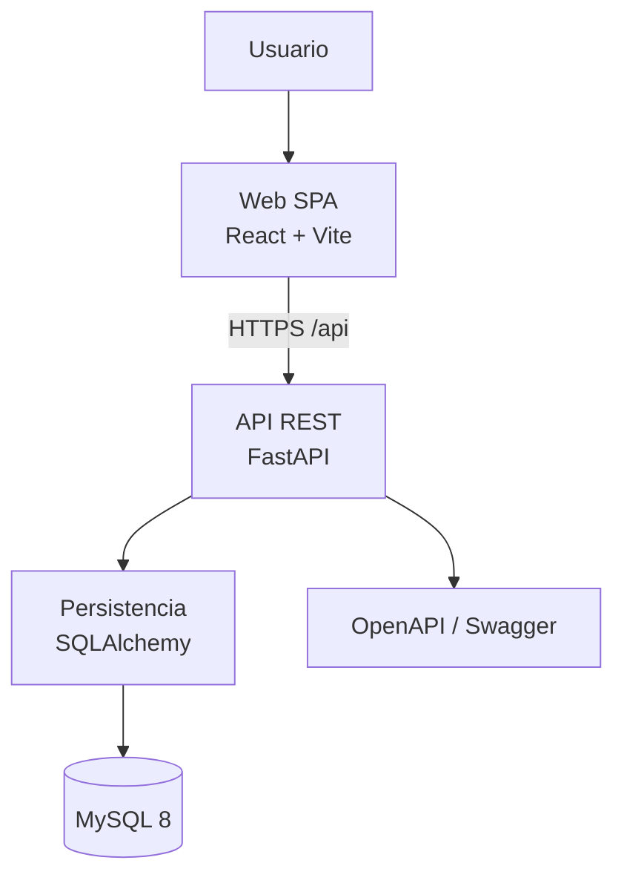
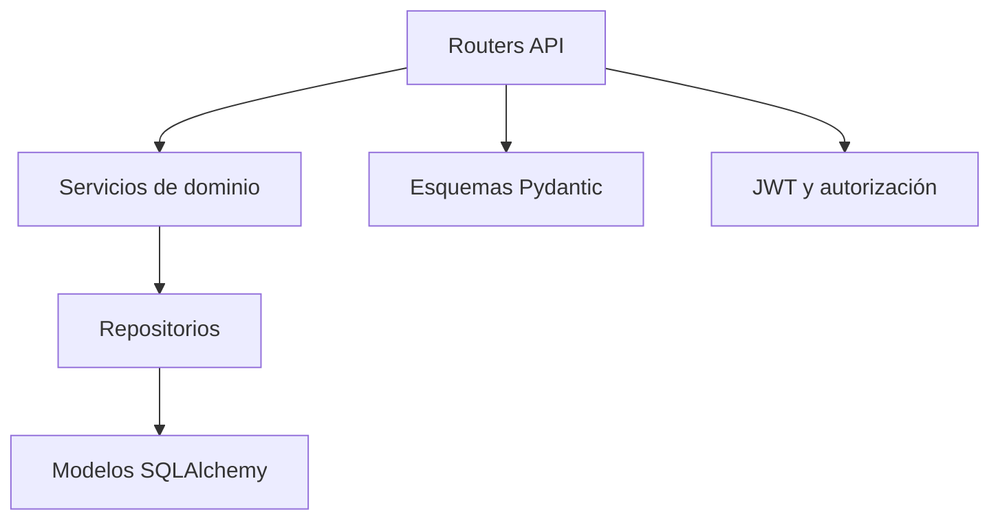
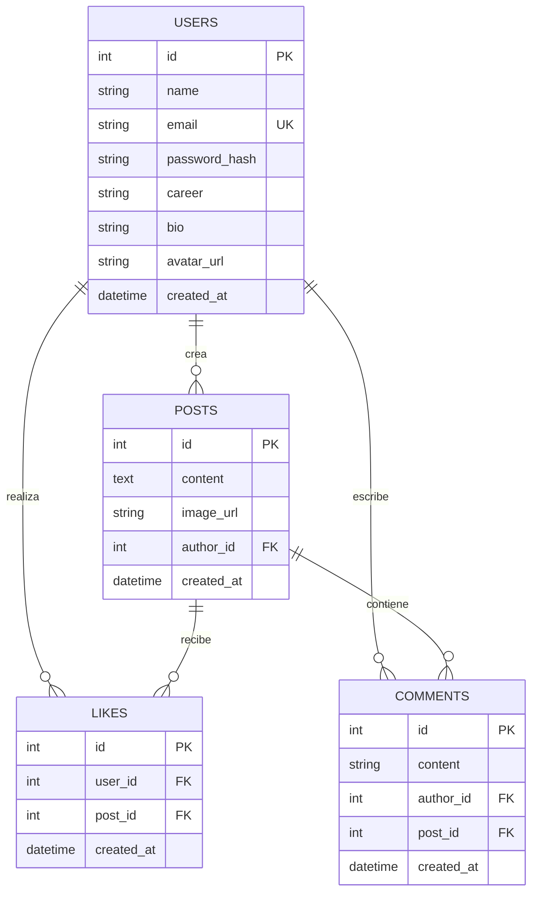
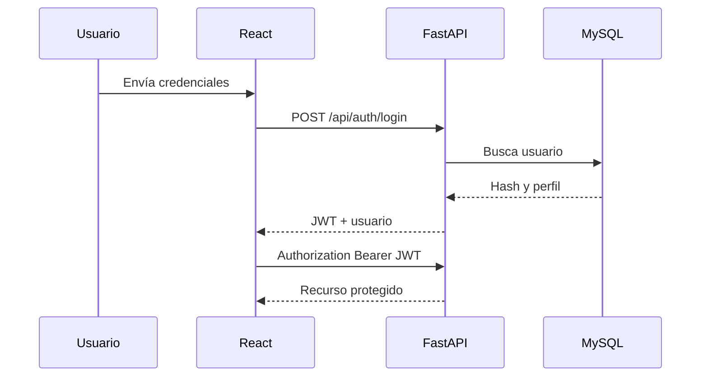

# S03 — Arquitectura de Nexora

> Estado: Cerrado en f₃ | Skill: K-002 Architecture Designer

## 1. Estilo arquitectónico

Nexora implementa arquitectura cliente-servidor de tres capas con frontend SPA desacoplado, API REST stateless y persistencia relacional. Cada despliegue es independiente y se conecta mediante contratos HTTP y variables de entorno.

## 2. C4 — Nivel 1: contexto

## 3. C4 — Nivel 2: contenedores

| Contenedor | Responsabilidad | Despliegue |
|---|---|---|
| Web SPA | UI, rutas, estado de sesión y consumo HTTP | Vercel |
| API REST | Validación, autorización, negocio y serialización | Render |
| MySQL | Persistencia transaccional | Aiven MySQL |

## 4. C4 — Nivel 3: componentes de la API

### Backend

- `routers/`: endpoints de auth, usuarios, publicaciones y dashboard.
- `services/`: reglas de aplicación y transacciones.
- `repositories/`: consultas SQLAlchemy; sin lógica HTTP.
- `models/`: entidades y relaciones MySQL.
- `schemas/`: entrada/salida Pydantic.
- `core/`: configuración, seguridad y dependencias compartidas.
- `db/`: sesión, base declarativa y seeder.

### Frontend

- `pages/`: Login, Registro, Feed, Perfil y Dashboard.
- `components/`: Navbar, Composer, PostCard, CommentList y UI reutilizable.
- `context/`: estado de autenticación.
- `services/`: cliente HTTP y funciones por recurso.
- `hooks/`: lógica reutilizable del cliente.
- `styles/`: tokens visuales y CSS responsive.

## 5. Modelo lógico

### Restricciones de integridad

- `users.email` es único y normalizado a minúsculas.
- `likes(user_id, post_id)` tiene índice único compuesto.
- Todas las claves foráneas sociales eliminan registros dependientes en cascada.
- `posts.content` y `comments.content` no aceptan contenido vacío después de `trim`.

## 6. Flujo de autenticación

## 7. Principios y límites

- El frontend nunca se conecta directamente a MySQL.
- Los routers no ejecutan SQL directo.
- Los servicios no conocen detalles de React.
- El token identifica al usuario; ningún `user_id` del cliente autoriza acciones.
- CORS acepta solo orígenes declarados en `CORS_ORIGINS`.
- Las imágenes son referencias HTTPS; el MVP no almacena archivos.
- Los secretos se proporcionan mediante variables de entorno.

## 8. Trazabilidad

| Decisión | Requisitos principales |
|---|---|
| SPA + REST | RNF-008, RNF-010, RF-018 |
| JWT stateless | RF-003, RF-017, RNF-004 |
| MySQL relacional | RF-001–RF-016, RNF-008 |
| Capas backend | RNF-006, RNF-010 |
| Despliegue separado | OBJ-05, RNF-012 |

